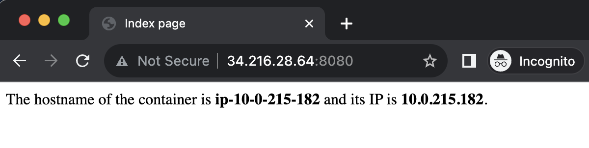
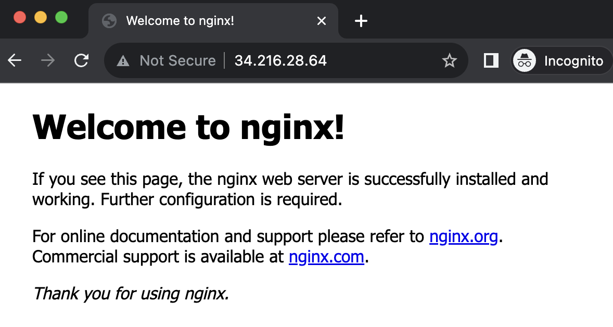

# Sattelite EKS node using Ubuntu EC2

**THIS IS EXPERIMENTAL.**

To sum, any EC2 instance can be an EKS node outside of VPC as long as it's created as a [fargate-kind node](https://github.com/leptonai/lepton/issues/2267#issuecomment-1673969397), and with host networking, we can run pods on the satellite node.

## Goals

- On-prem node running outside of VPC can be authorized to join the EKS cluster.
- The node can be stably running sending heartbeats to the EKS cluster.
- The node can run a pod(s).
- The node can run Kubernetes deployments with services, using Node IP.

## Non-goals

- GPU workloads.

## Prerequisites

- EC2 instance with Ubuntu 20.04 or 22.04, outside of EKS cluster VPC
- EKS cluster
  - We will modity aws-auth configmap so highly recommend against using the existing one.
  - If we modify wrong, you will be locked out of the cluster access.

`machine` CLI (helper tool to create ENI resources):

```bash
cd ${HOME}/lepton
go build -o /tmp/ma ./machine
/tmp/ma -h
cp /tmp/ma ${GOPATH}/bin/ma

ma a w
```

`machine-rs` CLI (helper tool to create EC2 instance):

```bash
cd ${HOME}/lepton/machine-rs
./scripts/build.release.sh
./target/release/machine-rs aws default-spec -h
```

## Steps

### Step 1. Create/pick a cluster to create a node

Preferrably, create a new `eks-lepton` cluster for this experiment.

### Step 2. Create an ENI for the satellite node

```bash
# to pick subnet ID + security group ID
ma a -r us-east-1 k l
ma a -r us-east-1 v g vpc-025a3ad8d69fbb215

# to create an ENI
ma a -r us-east-1 n c \
--subnet-id subnet-022e4fbce39f8b55f \
--sg-ids sg-05723340379377079 \
--name gh057-satellite-node-01 \
--description gh057-satellite-node-01

# to list ENIs
ma a -r us-east-1 n l
ma a -r us-east-1 n g eni-06dc93b0a12f532b9
```

```text
*-----------------------*-------------------------*------------*------------*---------------------------*-----------------------*--------------------------*------------*----------------------*
|        ENI ID         |     ENI DESCRIPTION     | ENI STATUS | PRIVATE IP |        PRIVATE DNS        |        VPC ID         |        SUBNET ID         |     AZ     |         SGS          |
*-----------------------*-------------------------*------------*------------*---------------------------*-----------------------*--------------------------*------------*----------------------*
| eni-06dc93b0a12f532b9 | gh057-satellite-node-01 | available  | 10.0.5.26  | ip-10-0-5-26.ec2.internal | vpc-025a3ad8d69fbb215 | subnet-022e4fbce39f8b55f | us-east-1a | sg-05723340379377079 |
*-----------------------*-------------------------*------------*------------*---------------------------*-----------------------*--------------------------*------------*----------------------*
```

```bash
ma a -r us-east-1 k n s h eni-06dc93b0a12f532b9
# fargate-ip-10-0-5-26.us-east-1.compute.internal
```

```bash
# to delete an ENI
# ma a -r us-east-1 n d eni-06dc93b0a12f532b9
```

### Step 3. Create an EC2 instance for the satellite node

```bash
cd $HOME/lepton/machine-rs
./target/release/machine-rs aws default-spec \
--instance-mode on-demand \
--instance-size large \
--ip-mode elastic \
--region us-west-2 \
--arch-type amd64 \
--os-type ubuntu22.04 \
--volume-type gp3 \
--volume-size-in-gb 300 \
--volume-iops 3000 \
--id-prefix my-dev \
--plugins imds,provider-id,vercmp,setup-local-disks,mount-bpf-fs,time-sync,system-limit-bump,aws-cli,ssm-agent,cloudwatch-agent,static-volume-provisioner,static-ip-provisioner,go,docker,containerd,runc,cni-plugins,ecr-credential-helper,ecr-credential-provider,kubelet,kubectl,cleanup-image-packages \
--wait-for-init-script-completion \
--spec-file-path satellite.cpu.us-west-2.yaml

# run the following to create resources
/Users/leegyuho/lepton/machine-rs/target/release/machine-rs aws apply \
--spec-file-path satellite.cpu.us-west-2.yaml

# to delete after experiments
./target/release/machine-rs aws delete \
--delete-all \
--skip-prompt \
--spec-file-path satellite.cpu.us-west-2.yaml
```

### Step 4. Download EKS kubeconfig and CA certificate

```bash
ma a -r us-east-1 k l
ma a -r us-east-1 k k gh057
ma a -r us-east-1 k k gh057 -k /tmp/gh057.kubeconfig
```

```bash
aws eks update-kubeconfig --region us-east-1 --name gh057

DESCRIBE_CLUSTER_RESULT="/tmp/describe_cluster_result.txt"
aws eks describe-cluster \
--region=us-east-1 \
--name=gh057 \
--output=text \
--query 'cluster.{certificateAuthorityData: certificateAuthority.data, endpoint: endpoint, serviceIpv4Cidr: kubernetesNetworkConfig.serviceIpv4Cidr, serviceIpv6Cidr: kubernetesNetworkConfig.serviceIpv6Cidr, clusterIpFamily: kubernetesNetworkConfig.ipFamily, outpostArn: outpostConfig.outpostArns[0], id: id}' > $DESCRIBE_CLUSTER_RESULT

cat $DESCRIBE_CLUSTER_RESULT

B64_CLUSTER_CA=$(cat $DESCRIBE_CLUSTER_RESULT | awk '{print $1}')
APISERVER_ENDPOINT=$(cat $DESCRIBE_CLUSTER_RESULT | awk '{print $3}')
CLUSTER_ID_IN_DESCRIBE_CLUSTER_RESULT=$(cat $DESCRIBE_CLUSTER_RESULT | awk '{print $4}')
CLUSTER_ID=${CLUSTER_ID_IN_DESCRIBE_CLUSTER_RESULT}
OUTPOST_ARN=$(cat $DESCRIBE_CLUSTER_RESULT | awk '{print $5}')
SERVICE_IPV4_CIDR=$(cat $DESCRIBE_CLUSTER_RESULT | awk '{print $6}')
SERVICE_IPV6_CIDR=$(cat $DESCRIBE_CLUSTER_RESULT | awk '{print $7}')
IP_FAMILY="ipv4"

CA_CERTIFICATE_DIRECTORY=/tmp/k8s-pki
CA_CERTIFICATE_FILE_PATH=$CA_CERTIFICATE_DIRECTORY/ca.crt
mkdir -p $CA_CERTIFICATE_DIRECTORY
# sudo mkdir -p $CA_CERTIFICATE_DIRECTORY
# sudo chown -R ubuntu $CA_CERTIFICATE_DIRECTORY
echo $B64_CLUSTER_CA | base64 -d > $CA_CERTIFICATE_FILE_PATH
cat $CA_CERTIFICATE_FILE_PATH

cat /tmp/gh057.kubeconfig
cat /tmp/k8s-pki/ca.crt
```

### Step 5. Download EKS kubeconfig, CA certificate, kubelet config, containerd config, CNI config in the satellite node

This can be done in many ways. For simplicity, we just use `scp` to copy the files.

```bash
# run these in the remote satellite node

sudo mkdir -p /var/lib/kubelet
sudo chown -R ubuntu /var/lib/kubelet
sudo mkdir -p /etc/kubernetes/kubelet
sudo chown -R ubuntu /etc/kubernetes/kubelet
sudo mkdir -p /etc/kubernetes/pki
sudo chown -R ubuntu /etc/kubernetes/pki
sudo chown -R ubuntu /etc/containerd
find /etc/containerd
find /opt/cni/bin
sudo mkdir -p /etc/cni/net.d
sudo chown -R ubuntu /etc/cni/net.d
sudo chown -R ubuntu /etc/sysctl.d/
```

```bash
# run these in the local machine

# kubeconfig
scp -i satellite.cpu.us-west-2-ec2-access.key /tmp/gh057.kubeconfig ubuntu@34.216.28.64:/var/lib/kubelet/kubeconfig

# CA
scp -i satellite.cpu.us-west-2-ec2-access.key /tmp/k8s-pki/ca.crt ubuntu@34.216.28.64:/etc/kubernetes/pki/ca.crt

# kubelet config
scp -i satellite.cpu.us-west-2-ec2-access.key \
satellite-aws/kubelet-config.yaml \
ubuntu@34.216.28.64:/etc/kubernetes/kubelet/kubelet-config.yaml

# kubelet configuration
# without it,
# "Failed to start ContainerManager" err="[invalid kernel flag: vm/overcommit_memory, expected value: 1, actual value: 0, invalid kernel flag: kernel/panic, expected value: 10, actual value: -1, invalid kernel flag: kernel/panic_on_oops, expected value: 1, actual value: 0]"
scp -i satellite.cpu.us-west-2-ec2-access.key \
satellite-aws/kubelet-config-overcommit.conf \
ubuntu@34.216.28.64:/etc/sysctl.d/90-kubelet.conf

# containerd config
scp -i satellite.cpu.us-west-2-ec2-access.key \
satellite-aws/containerd.toml \
ubuntu@34.216.28.64:/etc/containerd/config.toml

# cni config
scp -i satellite.cpu.us-west-2-ec2-access.key \
satellite-aws/cni-host-network.conf \
ubuntu@34.216.28.64:/etc/cni/net.d/10-host-network.conf
```

```bash
# run these in the remote satellite node

cat /var/lib/kubelet/kubeconfig
cat /etc/kubernetes/pki/ca.crt
cat /etc/kubernetes/kubelet/kubelet-config.yaml
cat /etc/containerd/config.toml
cat /etc/cni/net.d/10-host-network.conf
cat /etc/sysctl.d/90-kubelet.conf

# to disable aws-cni
sudo rm -f /etc/cni/net.d/10-aws.conflist

sudo sysctl -p /etc/sysctl.d/90-kubelet.conf
sudo systemctl status containerd
sudo systemctl restart containerd
```

### Step 6. Add a new rolearn entry to aws-auth configmap

This is required for the satellite node authorization.

```bash
ma a -r us-east-1 k n s h eni-06dc93b0a12f532b9
# fargate-ip-10-0-5-26.us-east-1.compute.internal

# that the kubelet will be using to join the cluster as a node
# if we use mapRoles, the "rolearn" must be able to assumed (if run locally)
# remember this is the one to be used in remote/satelitte node
ma a -r us-east-1 k a g --cluster-name gh057
kubectl -n kube-system get configmap aws-auth -o yaml
kubectl -n kube-system edit configmap aws-auth
```

Here, `arn:aws:iam::605454121064:role/my-dev-202308-QD9Q2W-instance-role` is the instance role assumed by the satellite node instance/kubelet.

```yaml
apiVersion: v1
data:
  mapRoles: |
    - groups:
      - system:bootstrappers
      - system:nodes
      rolearn: arn:aws:iam::605454121064:role/gh057-mng-role
      username: system:node:{{EC2PrivateDNSName}}
    - groups:
      - system:bootstrappers
      - system:nodes
      rolearn: arn:aws:iam::605454121064:role/my-dev-202308-QD9Q2W-instance-role
      username: system:node:fargate-ip-10-0-5-26.us-east-1.compute.internal
```

### Step 7. Create a fargate node object

This is only required for the satellite node to be able to join the cluster at the beginning.

```bash
ma a --region us-east-1 k n s a \
--cluster-name gh057 \
--eni-id eni-06dc93b0a12f532b9 \
--keep=true \
--keep-interval=10s
```

### Step 8. Start kubelet in the satellite node

```bash
ma a -r us-east-1 k n s h eni-06dc93b0a12f532b9
# fargate-ip-10-0-5-26.us-east-1.compute.internal
```

```text
[Unit]
Description=kubelet

[Service]
Type=exec
TimeoutStartSec=300
Restart=always
RestartSec=5s
LimitNOFILE=40000
ExecStart=/usr/bin/kubelet --config=/etc/kubernetes/kubelet/kubelet-config.yaml --kubeconfig=/var/lib/kubelet/kubeconfig --container-runtime-endpoint=unix:///run/containerd/containerd.sock --image-credential-provider-config /etc/eks/image-credential-provider/config.json --image-credential-provider-bin-dir /etc/eks/image-credential-provider --hostname-override fargate-ip-10-0-5-26.us-east-1.compute.internal
StandardOutput=append:/var/log/kubelet.log
StandardError=append:/var/log/kubelet.log

[Install]
WantedBy=multi-user.target
```

```bash
sudo vi /tmp/kubelet.service
sudo cp /tmp/kubelet.service /etc/systemd/system/kubelet.service

sudo systemctl daemon-reload
# in case it's already running
sudo systemctl stop kubelet.service
sudo systemctl disable kubelet.service
sudo systemctl enable kubelet.service
sudo systemctl restart --no-block kubelet.service

sudo tail -f /var/log/kubelet.log
```

Successful logs:

```bash
k get nodes

NAME                                              STATUS   ROLES    AGE     VERSION
fargate-ip-10-0-5-26.us-east-1.compute.internal   Ready    agent    36s     v1.26.7
ip-10-0-35-51.ec2.internal                        Ready    <none>   4h43m   v1.26.6
```

```bash
k describe node fargate-ip-10-0-5-26.us-east-1.compute.internal

Name:               fargate-ip-10-0-5-26.us-east-1.compute.internal
Roles:              agent
Labels:             beta.kubernetes.io/arch=amd64
                    beta.kubernetes.io/os=linux
                    kubernetes.io/arch=amd64
                    kubernetes.io/hostname=fargate-ip-10-0-5-26.us-east-1.compute.internal
                    kubernetes.io/os=linux
                    kubernetes.io/role=agent
Annotations:        csi.volume.kubernetes.io/nodeid: {"csi.tigera.io":"fargate-ip-10-0-5-26.us-east-1.compute.internal","efs.csi.aws.com":"i-080bbf078e9bcb326"}
                    node.alpha.kubernetes.io/ttl: 0
                    volumes.kubernetes.io/controller-managed-attach-detach: true
CreationTimestamp:  Fri, 18 Aug 2023 21:41:00 +0800
Taints:             virtual-kubelet.io/provider=ec2:NoSchedule
Unschedulable:      false
Lease:
  HolderIdentity:  fargate-ip-10-0-5-26.us-east-1.compute.internal
  AcquireTime:     <unset>
  RenewTime:       Fri, 18 Aug 2023 21:41:45 +0800
Conditions:
  Type                 Status  LastHeartbeatTime                 LastTransitionTime                Reason         Message
  ----                 ------  -----------------                 ------------------                ------         -------
  Ready                True    Fri, 18 Aug 2023 21:41:36 +0800   Fri, 18 Aug 2023 21:40:57 +0800   KubeletReady   kubelet is posting ready status. AppArmor enabled
  PIDPressure          False   Fri, 18 Aug 2023 21:41:36 +0800   Fri, 18 Aug 2023 21:40:57 +0800                  ok
  MemoryPressure       False   Fri, 18 Aug 2023 21:41:36 +0800   Fri, 18 Aug 2023 21:40:57 +0800                  ok
  DiskPressure         False   Fri, 18 Aug 2023 21:41:36 +0800   Fri, 18 Aug 2023 21:40:57 +0800                  ok
  NetworkUnavailable   False   Fri, 18 Aug 2023 21:40:58 +0800   Fri, 18 Aug 2023 21:40:57 +0800                  ok
  KubeletConfigOk      True    Fri, 18 Aug 2023 21:40:58 +0800   Fri, 18 Aug 2023 21:40:57 +0800                  ok
Addresses:
  InternalIP:  10.0.215.182
  Hostname:    fargate-ip-10-0-5-26.us-east-1.compute.internal
Capacity:
  cpu:                2
  ephemeral-storage:  20134592Ki
  hugepages-1Gi:      0
  hugepages-2Mi:      0
  memory:             8046120Ki
  pods:               110
  storage:            400Gi
Allocatable:
  cpu:                2
  ephemeral-storage:  18556039957
  hugepages-1Gi:      0
  hugepages-2Mi:      0
  memory:             7943720Ki
  pods:               110
  storage:            400Gi
System Info:
  Machine ID:                 ec2b9200ce03e1847645617d13817738
  System UUID:                ec2b9200-ce03-e184-7645-617d13817738
  Boot ID:                    73de5af0-9df5-4a12-8a16-8a9ca38aa600
  Kernel Version:             5.19.0-1029-aws
  OS Image:                   Ubuntu 22.04.3 LTS
  Operating System:           linux
  Architecture:               amd64
  Container Runtime Version:  containerd://1.7.3
  Kubelet Version:            v1.26.7
  Kube-Proxy Version:         v1.26.7
Non-terminated Pods:          (7 in total)
  Namespace                   Name                                                    CPU Requests  CPU Limits  Memory Requests  Memory Limits  Age
  ---------                   ----                                                    ------------  ----------  ---------------  -------------  ---
  calico-system               calico-node-f2xtj                                       0 (0%)        0 (0%)      0 (0%)           0 (0%)         49s
  calico-system               csi-node-driver-2ndv2                                   0 (0%)        0 (0%)      0 (0%)           0 (0%)         49s
  kube-prometheus-stack       kube-prometheus-stack-prometheus-node-exporter-pnqkn    0 (0%)        0 (0%)      0 (0%)           0 (0%)         49s
  kube-system                 aws-node-pq4nw                                          25m (1%)      0 (0%)      0 (0%)           0 (0%)         49s
  kube-system                 ebs-csi-node-72b5h                                      30m (1%)      0 (0%)      120Mi (1%)       768Mi (9%)     49s
  kube-system                 efs-csi-node-prmhx                                      0 (0%)        0 (0%)      0 (0%)           0 (0%)         49s
  kube-system                 kube-proxy-dqjn6                                        100m (5%)     0 (0%)      0 (0%)           0 (0%)         49s
Allocated resources:
  (Total limits may be over 100 percent, i.e., overcommitted.)
  Resource           Requests    Limits
  --------           --------    ------
  cpu                155m (7%)   0 (0%)
  memory             120Mi (1%)  768Mi (9%)
  ephemeral-storage  0 (0%)      0 (0%)
  hugepages-1Gi      0 (0%)      0 (0%)
  hugepages-2Mi      0 (0%)      0 (0%)
  storage            0           0
Events:
  Type     Reason                   Age                From             Message
  ----     ------                   ----               ----             -------
  Normal   Starting                 39s                kube-proxy
  Normal   Starting                 50s                kubelet          Starting kubelet.
  Warning  InvalidDiskCapacity      50s                kubelet          invalid capacity 0 on image filesystem
  Normal   NodeHasSufficientMemory  50s (x2 over 50s)  kubelet          Node fargate-ip-10-0-5-26.us-east-1.compute.internal status is now: NodeHasSufficientMemory
  Normal   NodeHasNoDiskPressure    50s (x2 over 50s)  kubelet          Node fargate-ip-10-0-5-26.us-east-1.compute.internal status is now: NodeHasNoDiskPressure
  Normal   NodeHasSufficientPID     50s (x2 over 50s)  kubelet          Node fargate-ip-10-0-5-26.us-east-1.compute.internal status is now: NodeHasSufficientPID
  Normal   NodeAllocatableEnforced  50s                kubelet          Updated Node Allocatable limit across pods
  Normal   RegisteredNode           48s                node-controller  Node fargate-ip-10-0-5-26.us-east-1.compute.internal event: Registered Node fargate-ip-10-0-5-26.us-east-1.compute.internal in Controller
  Warning  MissingClusterDNS        7s (x15 over 47s)  kubelet          kubelet does not have ClusterDNS IP configured and cannot create Pod using "ClusterFirst" policy. Falling back to "Default" policy.
```

### Step 9. Deploy test node port app

```bash
k apply -f ./satellite-aws/node-port-app.yaml
k get po -o wide

k apply -f ./satellite-aws/nginx.yaml
k get po -o wide
```

For the host network to work, we need to disable aws-cni plugin in the fargate-kind (satellite) node. Otherwise, it will error as:

> Warning  FailedCreatePodSandBox  42s               kubelet            Failed to create pod sandbox: rpc error: code = Unknown desc = failed to setup network for sandbox "c821c7fd69b3f6fb5191eebc3ab0049cafa3fc37a9205b8ae2179759f2e78898": plugin type="aws-cni" name="aws-cni" failed (add): add cmd: Error received from AddNetwork gRPC call: rpc error: code = Unavailable desc = connection error: desc = "transport: Error while dialing dial tcp 127.0.0.1:50051: connect: connection refused"

Either `rm -f /etc/cni/net.d/10-aws.conflist` or add taint selector to the `aws-node` daemonset:

```yaml
spec:
  revisionHistoryLimit: 10
  selector:
    matchLabels:
      k8s-app: aws-node
  template:
    metadata:
      creationTimestamp: null
      labels:
        app.kubernetes.io/instance: aws-vpc-cni
        app.kubernetes.io/name: aws-node
        k8s-app: aws-node
    spec:
      affinity:
        nodeAffinity:
          requiredDuringSchedulingIgnoredDuringExecution:
            nodeSelectorTerms:
            - matchExpressions:
              - key: kubernetes.io/os
                operator: In
                values:
                - linux
              - key: kubernetes.io/arch
                operator: In
                values:
                - amd64
                - arm64
              - key: eks.amazonaws.com/compute-type
                operator: NotIn
                values:
                - fargate
              - key: virtual-kubelet.io/provider
                operator: DoesNotExist
```

And connect to the service using the EC2 instance public IP + port 8080:




