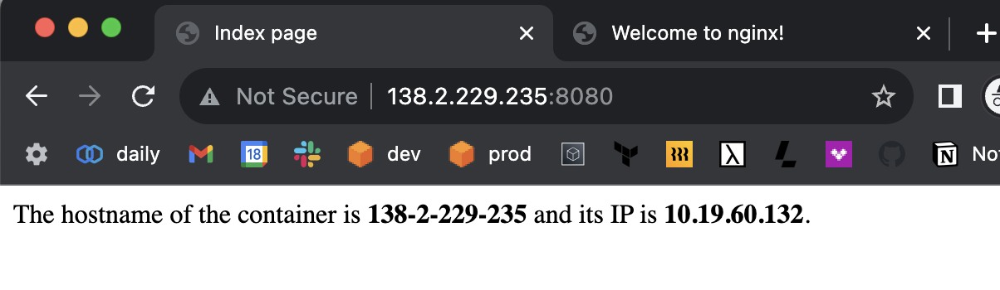
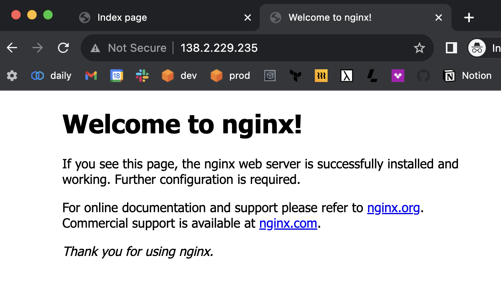

# Sattelite EKS node using Lambda Labs

**THIS IS EXPERIMENTAL.**

To sum, any Lambda machine can be an EKS node outside of AWS as long as it's created as a [fargate-kind node](https://github.com/leptonai/lepton/issues/2267#issuecomment-1673969397), and with host networking, we can run pods on the satellite node.

## Goals

- On-prem node running outside of AWS can be authorized to join the EKS cluster.
- The node can be stably running sending heartbeats to the EKS cluster.
- The node can run a pod(s).
- The node can run Kubernetes deployments with services, using Node IP.

## TODOs

- GPU workloads.
- Connect via VPN.
- See [GH#2663](https://github.com/leptonai/lepton/issues/2663) for more.

## Prerequisites

- Lambda Labs instance with Ubuntu 20.04 or 22.04, outside of EKS cluster VPC
- EKS cluster
  - We will modity aws-auth configmap so highly recommend against using the existing one.
  - If we modify wrong, you will be locked out of the cluster access.

`machine` CLI (helper tool to create ENI resources):

```bash
cd ${HOME}/lepton
go build -o /tmp/ma ./machine
/tmp/ma -h
cp /tmp/ma ${GOPATH}/bin/ma

ma a w
```

## Steps

### Step 1. Create/pick a cluster to create a node

Preferrably, create a new `eks-lepton` cluster for this experiment.

### Step 2. Create an ENI for the satellite node

```bash
# to pick subnet ID + security group ID
ma a -r us-east-1 k l
ma a -r us-east-1 v g vpc-0776c6668008e90a9

# to create an ENI
ma a -r us-east-1 n c \
--subnet-id subnet-051a611f159253cba \
--sg-ids sg-03ed97e5202d027ed \
--name gh058-satellite-node-01 \
--description gh058-satellite-node-01

# to list ENIs
ma a -r us-east-1 n l
ma a -r us-east-1 n g eni-086d663f3201384e3
```

```text
*-----------------------*-------------------------*------------*------------*---------------------------*-----------------------*--------------------------*------------*----------------------*
|        ENI ID         |     ENI DESCRIPTION     | ENI STATUS | PRIVATE IP |        PRIVATE DNS        |        VPC ID         |        SUBNET ID         |     AZ     |         SGS          |
*-----------------------*-------------------------*------------*------------*---------------------------*-----------------------*--------------------------*------------*----------------------*
| eni-086d663f3201384e3 | gh058-satellite-node-01 | available  | 10.0.2.27  | ip-10-0-2-27.ec2.internal | vpc-0776c6668008e90a9 | subnet-051a611f159253cba | us-east-1a | sg-03ed97e5202d027ed |
*-----------------------*-------------------------*------------*------------*---------------------------*-----------------------*--------------------------*------------*----------------------*
```

```bash
ma a -r us-east-1 k n s h eni-086d663f3201384e3
# fargate-ip-10-0-2-27.us-east-1.compute.internal
```

```bash
# to delete an ENI
# ma a -r us-east-1 n d eni-086d663f3201384e3
```

### Step 3. Create a Lambda Cloud instance for the satellite node

```bash
ma l i l
ma l i c \
--name gyuho-test \
--instance-type gpu_1x_a10 \
--region us-west-1 \
--ssh-key-names gyuho-test
```

### Step 4. Download EKS kubeconfig and CA certificate

```bash
ma a -r us-east-1 k l
ma a -r us-east-1 k k gh058
ma a -r us-east-1 k k gh058 -k /tmp/gh058.kubeconfig
```

```bash
aws eks update-kubeconfig --region us-east-1 --name gh058

DESCRIBE_CLUSTER_RESULT="/tmp/describe_cluster_result.txt"
aws eks describe-cluster \
--region=us-east-1 \
--name=gh058 \
--output=text \
--query 'cluster.{certificateAuthorityData: certificateAuthority.data, endpoint: endpoint, serviceIpv4Cidr: kubernetesNetworkConfig.serviceIpv4Cidr, serviceIpv6Cidr: kubernetesNetworkConfig.serviceIpv6Cidr, clusterIpFamily: kubernetesNetworkConfig.ipFamily, outpostArn: outpostConfig.outpostArns[0], id: id}' > $DESCRIBE_CLUSTER_RESULT

cat $DESCRIBE_CLUSTER_RESULT

B64_CLUSTER_CA=$(cat $DESCRIBE_CLUSTER_RESULT | awk '{print $1}')
APISERVER_ENDPOINT=$(cat $DESCRIBE_CLUSTER_RESULT | awk '{print $3}')
CLUSTER_ID_IN_DESCRIBE_CLUSTER_RESULT=$(cat $DESCRIBE_CLUSTER_RESULT | awk '{print $4}')
CLUSTER_ID=${CLUSTER_ID_IN_DESCRIBE_CLUSTER_RESULT}
OUTPOST_ARN=$(cat $DESCRIBE_CLUSTER_RESULT | awk '{print $5}')
SERVICE_IPV4_CIDR=$(cat $DESCRIBE_CLUSTER_RESULT | awk '{print $6}')
SERVICE_IPV6_CIDR=$(cat $DESCRIBE_CLUSTER_RESULT | awk '{print $7}')
IP_FAMILY="ipv4"

CA_CERTIFICATE_DIRECTORY=/tmp/k8s-pki
CA_CERTIFICATE_FILE_PATH=$CA_CERTIFICATE_DIRECTORY/ca.crt
mkdir -p $CA_CERTIFICATE_DIRECTORY
# sudo mkdir -p $CA_CERTIFICATE_DIRECTORY
# sudo chown -R ubuntu $CA_CERTIFICATE_DIRECTORY
echo $B64_CLUSTER_CA | base64 -d > $CA_CERTIFICATE_FILE_PATH
cat $CA_CERTIFICATE_FILE_PATH

cat /tmp/gh058.kubeconfig
cat /tmp/k8s-pki/ca.crt
```

### Step 5. Install dependencies in Lambda Cloud instance

```bash
# Welcome to Ubuntu 20.04.5 LTS (GNU/Linux 5.15.0-67-generic x86_64)
ssh -o "StrictHostKeyChecking no" -i ~/.lambda-labs/ssh.private.pem ubuntu@138.2.229.235

# aws, docker, containerd, runc are already installed
scp -i ~/.lambda-labs/ssh.private.pem ./satellite-lambda/init.bash ubuntu@138.2.229.235:/tmp/init.bash
```

In the remote machine:

```bash
# ssh
vi /tmp/init.bash
sudo bash /tmp/init.bash
```

### Step 6. Download EKS kubeconfig, CA certificate, kubelet config, containerd config, CNI config in the satellite node

This can be done in many ways. For simplicity, we just use `scp` to copy the files.

```bash
# run these in the remote satellite node

sudo mkdir -p /var/lib/kubelet
sudo chown -R ubuntu /var/lib/kubelet
sudo mkdir -p /etc/kubernetes/kubelet
sudo chown -R ubuntu /etc/kubernetes/kubelet
sudo mkdir -p /etc/kubernetes/pki
sudo chown -R ubuntu /etc/kubernetes/pki
sudo chown -R ubuntu /etc/containerd
find /etc/containerd
find /opt/cni/bin
sudo mkdir -p /etc/cni/net.d
sudo chown -R ubuntu /etc/cni/net.d
sudo chown -R ubuntu /etc/sysctl.d/
```

```bash
# run these in the local machine

# kubeconfig
scp -i ~/.lambda-labs/ssh.private.pem /tmp/gh058.kubeconfig ubuntu@138.2.229.235:/var/lib/kubelet/kubeconfig

# CA
scp -i ~/.lambda-labs/ssh.private.pem /tmp/k8s-pki/ca.crt ubuntu@138.2.229.235:/etc/kubernetes/pki/ca.crt

# kubelet config
scp -i ~/.lambda-labs/ssh.private.pem \
satellite-lambda/kubelet-config.yaml \
ubuntu@138.2.229.235:/etc/kubernetes/kubelet/kubelet-config.yaml

# kubelet configuration
# without it,
# "Failed to start ContainerManager" err="[invalid kernel flag: vm/overcommit_memory, expected value: 1, actual value: 0, invalid kernel flag: kernel/panic, expected value: 10, actual value: -1, invalid kernel flag: kernel/panic_on_oops, expected value: 1, actual value: 0]"
scp -i ~/.lambda-labs/ssh.private.pem \
satellite-lambda/kubelet-config-overcommit.conf \
ubuntu@138.2.229.235:/etc/sysctl.d/90-kubelet.conf

# containerd config
scp -i ~/.lambda-labs/ssh.private.pem \
satellite-lambda/containerd.toml \
ubuntu@138.2.229.235:/etc/containerd/config.toml

# cni config
scp -i ~/.lambda-labs/ssh.private.pem \
satellite-lambda/cni-host-network.conf \
ubuntu@138.2.229.235:/etc/cni/net.d/10-host-network.conf
```

```bash
# run these in the remote satellite node

cat /var/lib/kubelet/kubeconfig
cat /etc/kubernetes/pki/ca.crt
cat /etc/kubernetes/kubelet/kubelet-config.yaml
cat /etc/containerd/config.toml
cat /etc/cni/net.d/10-host-network.conf
cat /etc/sysctl.d/90-kubelet.conf

sudo sysctl -p /etc/sysctl.d/90-kubelet.conf
sudo systemctl status containerd
sudo systemctl restart containerd
```

### Step 7. Add a new user entry to aws-auth configmap

This is required for the satellite node authorization.

```bash
aws sts get-caller-identity
# arn:aws:iam::605454121064:user/gyuho
# AIDAYZ57AXBUCE2ABSLCN

ma a -r us-east-1 k n s h eni-086d663f3201384e3
# fargate-ip-10-0-2-27.us-east-1.compute.internal

ma a --region us-east-1 k a g gh058
ma a --region us-east-1 k a a \
--cluster-name gh058 \
--groups system:bootstrappers,system:nodes \
--user-name system:node:fargate-ip-10-0-2-27.us-east-1.compute.internal \
--user-id AIDAYZ57AXBUCE2ABSLCN
```

```yaml
apiVersion: v1
data:
  mapRoles: |
    - rolearn: arn:aws:iam::605454121064:role/gh058-mng-role
      username: system:node:{{EC2PrivateDNSName}}
      groups:
      - system:bootstrappers
      - system:nodes
    - rolearn: ""
      username: system:node:fargate-ip-10-0-2-27.us-east-1.compute.internal
      groups:
      - system:bootstrappers
      - system:nodes
      userid: AIDAYZ57AXBUCE2ABSLCN
```

### Step 8. Create a fargate node object

This is only required for the satellite node to be able to join the cluster at the beginning.

```bash
ma a --region us-east-1 k n s a \
--cluster-name gh058 \
--eni-id eni-086d663f3201384e3 \
--keep=true \
--keep-interval=10s
```

### Step 9. Start kubelet in the satellite node

```bash
ma a -r us-east-1 k n s h eni-086d663f3201384e3
# fargate-ip-10-0-2-27.us-east-1.compute.internal
```

```bash
rm -f /tmp/kubelet.sh
vi /tmp/kubelet.sh
sudo chmod +x /tmp/kubelet.sh
sudo cp /tmp/kubelet.sh /usr/bin/kubelet.sh
```

```bash
AWS_ACCESS_KEY_ID=... \
AWS_SECRET_ACCESS_KEY=... \
aws eks update-kubeconfig --region us-east-1 --name gh058
kubectl get nodes

AWS_ACCESS_KEY_ID=... \
AWS_SECRET_ACCESS_KEY=... \
/usr/bin/kubelet --config=/etc/kubernetes/kubelet/kubelet-config.yaml --kubeconfig=/root/.kube/config --container-runtime-endpoint=unix:///run/containerd/containerd.sock --image-credential-provider-config /etc/eks/image-credential-provider/config.json --image-credential-provider-bin-dir /etc/eks/image-credential-provider --node-labels eks.amazonaws.com/compute-type=fargate --hostname-override fargate-ip-10-0-2-27.us-east-1.compute.internal
```

```bash
sudo rm -f /var/log/kubelet.log
vi /tmp/kubelet.service
sudo cp /tmp/kubelet.service /etc/systemd/system/kubelet.service
```

```text
[Unit]
Description=kubelet

[Service]
Type=simple
TimeoutStartSec=300
Restart=always
User=root
Group=root
RestartSec=5s
LimitNOFILE=40000
ExecStart=/usr/bin/kubelet.sh
StandardOutput=append:/var/log/kubelet.log
StandardError=append:/var/log/kubelet.log

[Install]
WantedBy=multi-user.target
```

```bash
sudo systemctl daemon-reload
# in case it's already running
sudo systemctl stop kubelet.service
sudo systemctl disable kubelet.service
sudo systemctl enable kubelet.service

sudo systemctl restart --no-block kubelet.service
sudo systemctl status kubelet.service

sudo tail -f /var/log/kubelet.log
```

Successful logs:

```bash
k get nodes

NAME                                              STATUS   ROLES    AGE   VERSION
fargate-ip-10-0-2-27.us-east-1.compute.internal   Ready    <none>   39m   v1.26.7
ip-10-0-19-126.ec2.internal                       Ready    <none>   17h   v1.26.6
```

```bash
k describe node fargate-ip-10-0-2-27.us-east-1.compute.internal

Name:               fargate-ip-10-0-2-27.us-east-1.compute.internal
Roles:              <none>
Labels:             beta.kubernetes.io/arch=amd64
                    beta.kubernetes.io/os=linux
                    eks.amazonaws.com/compute-type=fargate
                    kubernetes.io/arch=amd64
                    kubernetes.io/hostname=fargate-ip-10-0-2-27.us-east-1.compute.internal
                    kubernetes.io/os=linux
Annotations:        csi.volume.kubernetes.io/nodeid: {"csi.tigera.io":"fargate-ip-10-0-2-27.us-east-1.compute.internal"}
                    node.alpha.kubernetes.io/ttl: 0
                    volumes.kubernetes.io/controller-managed-attach-detach: true
CreationTimestamp:  Sun, 20 Aug 2023 11:49:27 +0800
Taints:             <none>
Unschedulable:      false
Lease:
  HolderIdentity:  fargate-ip-10-0-2-27.us-east-1.compute.internal
  AcquireTime:     <unset>
  RenewTime:       Sun, 20 Aug 2023 12:29:32 +0800
Conditions:
  Type             Status  LastHeartbeatTime                 LastTransitionTime                Reason                       Message
  ----             ------  -----------------                 ------------------                ------                       -------
  MemoryPressure   False   Sun, 20 Aug 2023 12:24:39 +0800   Sun, 20 Aug 2023 11:49:27 +0800   KubeletHasSufficientMemory   kubelet has sufficient memory available
  DiskPressure     False   Sun, 20 Aug 2023 12:24:39 +0800   Sun, 20 Aug 2023 11:49:27 +0800   KubeletHasNoDiskPressure     kubelet has no disk pressure
  PIDPressure      False   Sun, 20 Aug 2023 12:24:39 +0800   Sun, 20 Aug 2023 11:49:27 +0800   KubeletHasSufficientPID      kubelet has sufficient PID available
  Ready            True    Sun, 20 Aug 2023 12:24:39 +0800   Sun, 20 Aug 2023 11:49:28 +0800   KubeletReady                 kubelet is posting ready status. AppArmor enabled
Addresses:
  InternalIP:  10.19.60.132
  Hostname:    fargate-ip-10-0-2-27.us-east-1.compute.internal
Capacity:
  cpu:                30
  ephemeral-storage:  1422559648Ki
  hugepages-1Gi:      0
  hugepages-2Mi:      0
  memory:             206129480Ki
  pods:               110
Allocatable:
  cpu:                30
  ephemeral-storage:  1311030969427
  hugepages-1Gi:      0
  hugepages-2Mi:      0
  memory:             206027080Ki
  pods:               110
System Info:
  Machine ID:                 b5daa36c5840b3b9ca449c77043f147f
  System UUID:                147cac70-c9c0-4e5b-beb5-09d9aef1a610
  Boot ID:                    cea43fb4-6fa4-4aca-b3d0-98ed9461a4c1
  Kernel Version:             5.15.0-67-generic
  OS Image:                   Ubuntu 20.04.6 LTS
  Operating System:           linux
  Architecture:               amd64
  Container Runtime Version:  containerd://1.6.22
  Kubelet Version:            v1.26.7
  Kube-Proxy Version:         v1.26.7
Non-terminated Pods:          (5 in total)
  Namespace                   Name                                                    CPU Requests  CPU Limits  Memory Requests  Memory Limits  Age
  ---------                   ----                                                    ------------  ----------  ---------------  -------------  ---
  calico-system               csi-node-driver-tm5tl                                   0 (0%)        0 (0%)      0 (0%)           0 (0%)         100m
  default                     my-app-b97f997c4-cc798                                  0 (0%)        0 (0%)      0 (0%)           0 (0%)         80m
  default                     nginx                                                   0 (0%)        0 (0%)      0 (0%)           0 (0%)         80m
  gpu-operator                gpu-operator-node-feature-discovery-worker-8kwj6        0 (0%)        0 (0%)      0 (0%)           0 (0%)         44m
  kube-prometheus-stack       kube-prometheus-stack-prometheus-node-exporter-w4thz    0 (0%)        0 (0%)      0 (0%)           0 (0%)         100m
Allocated resources:
  (Total limits may be over 100 percent, i.e., overcommitted.)
  Resource           Requests  Limits
  --------           --------  ------
  cpu                0 (0%)    0 (0%)
  memory             0 (0%)    0 (0%)
  ephemeral-storage  0 (0%)    0 (0%)
  hugepages-1Gi      0 (0%)    0 (0%)
  hugepages-2Mi      0 (0%)    0 (0%)
Events:
  Type     Reason                   Age                  From             Message
  ----     ------                   ----                 ----             -------
  Warning  MissingClusterDNS        50m (x44 over 100m)  kubelet          kubelet does not have ClusterDNS IP configured and cannot create Pod using "ClusterFirst" policy. Falling back to "Default" policy.
  Normal   Starting                 44m                  kubelet          Starting kubelet.
  Warning  InvalidDiskCapacity      44m                  kubelet          invalid capacity 0 on image filesystem
  Normal   NodeHasSufficientMemory  44m (x2 over 44m)    kubelet          Node fargate-ip-10-0-2-27.us-east-1.compute.internal status is now: NodeHasSufficientMemory
  Normal   NodeHasNoDiskPressure    44m (x2 over 44m)    kubelet          Node fargate-ip-10-0-2-27.us-east-1.compute.internal status is now: NodeHasNoDiskPressure
  Normal   NodeHasSufficientPID     44m (x2 over 44m)    kubelet          Node fargate-ip-10-0-2-27.us-east-1.compute.internal status is now: NodeHasSufficientPID
  Normal   NodeAllocatableEnforced  44m                  kubelet          Updated Node Allocatable limit across pods
  Normal   NodeReady                44m                  kubelet          Node fargate-ip-10-0-2-27.us-east-1.compute.internal status is now: NodeReady
  Warning  MissingClusterDNS        43m (x15 over 44m)   kubelet          kubelet does not have ClusterDNS IP configured and cannot create Pod using "ClusterFirst" policy. Falling back to "Default" policy.
  Normal   NodeHasSufficientMemory  40m (x2 over 40m)    kubelet          Node fargate-ip-10-0-2-27.us-east-1.compute.internal status is now: NodeHasSufficientMemory
  Normal   NodeAllocatableEnforced  40m                  kubelet          Updated Node Allocatable limit across pods
  Warning  InvalidDiskCapacity      40m                  kubelet          invalid capacity 0 on image filesystem
  Normal   Starting                 40m                  kubelet          Starting kubelet.
  Normal   NodeHasNoDiskPressure    40m (x2 over 40m)    kubelet          Node fargate-ip-10-0-2-27.us-east-1.compute.internal status is now: NodeHasNoDiskPressure
  Normal   NodeHasSufficientPID     40m (x2 over 40m)    kubelet          Node fargate-ip-10-0-2-27.us-east-1.compute.internal status is now: NodeHasSufficientPID
  Normal   NodeReady                40m                  kubelet          Node fargate-ip-10-0-2-27.us-east-1.compute.internal status is now: NodeReady
  Normal   RegisteredNode           40m                  node-controller  Node fargate-ip-10-0-2-27.us-east-1.compute.internal event: Registered Node fargate-ip-10-0-2-27.us-east-1.compute.internal in Controller
  Warning  MissingClusterDNS        35m (x34 over 40m)   kubelet          kubelet does not have ClusterDNS IP configured and cannot create Pod using "ClusterFirst" policy. Falling back to "Default" policy.
  Normal   Starting                 30m                  kubelet          Starting kubelet.
  Warning  InvalidDiskCapacity      30m                  kubelet          invalid capacity 0 on image filesystem
  Normal   NodeHasSufficientMemory  30m (x2 over 30m)    kubelet          Node fargate-ip-10-0-2-27.us-east-1.compute.internal status is now: NodeHasSufficientMemory
  Normal   NodeHasNoDiskPressure    30m (x2 over 30m)    kubelet          Node fargate-ip-10-0-2-27.us-east-1.compute.internal status is now: NodeHasNoDiskPressure
  Normal   NodeHasSufficientPID     30m (x2 over 30m)    kubelet          Node fargate-ip-10-0-2-27.us-east-1.compute.internal status is now: NodeHasSufficientPID
  Normal   NodeAllocatableEnforced  30m                  kubelet          Updated Node Allocatable limit across pods
  Warning  MissingClusterDNS        33s (x173 over 30m)  kubelet          kubelet does not have ClusterDNS IP configured and cannot create Pod using "ClusterFirst" policy. Falling back to "Default" policy.
```

### Step 10. Deploy test node port app

```bash
k apply -f ./satellite-lambda/node-port-app.yaml
k apply -f ./satellite-lambda/nginx.yaml
k get po -o wide
```

- http://138.2.229.235:8080
- http://138.2.229.235

And connect to the service using the Lambda Labs instance public IP + port 8080:




