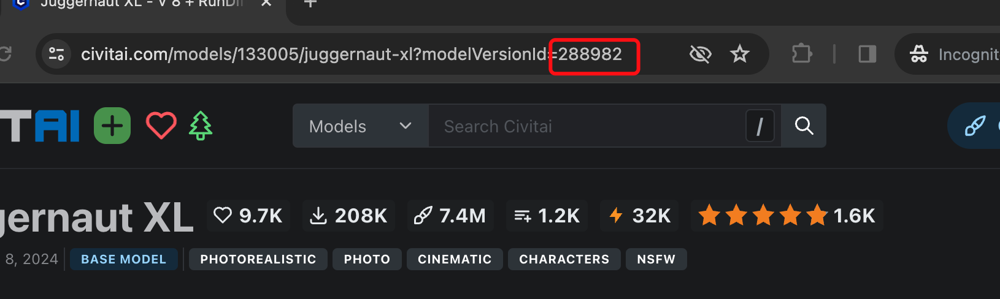

# Stable Diffusion Farm

Stable Diffusion Farm is setup for running stable diffusion workload with your choice of models. This template will allow you to:

- Setup image generation workload api such as text-to-image generation, image-to-image generation, etc.
- Use your own choice of models including lora, ckpt, etc.

This documentation will cover configurations including adding your choice of models, extensions, and access it via API.

# Configurations

Here are few configurations you can change to suit your needs:

- Name: The name of your deployment, like `my-stable-diffusion-farm`
- Resource Shape : Resource used for running the workload. `gpu.a10` is recommended
    - To run models with A100 / H100 or multiple cards, contact us for reserved computation resources via info@lepton.ai.
- Environment Variables
    - `MODELS(Optional)` : Pass in [CivitAI](https://civitai.com/) model version IDs to be pre-loaded into the deployment. If no model version IDs are given, you can also pass them over later via a txt2img call to load models on the fly. You can find the model version ID from the model page. For example, you can pass in `288982` to load [Juggernaut XL V8](https://civitai.com/models/133005?modelVersionId=288982). And you can also pass in multiple model version IDs by separating them with comma, like `288982,281176,276923`. The moodel version could be found here: 
    - `Extensions(Optional)` : Pass in git url to load your choice of extensions. For example, you can pass in `https://github.com/ototadana/sd-face-editor.git@3421017` to load [sd-face-editor](https://github.com/ototadana/sd-face-editor)
    - `CIVITAI_API_KEY(Optional)` : Pass in your [CivitAI](https://civitai.com/) API key to access your private models. 

Once these fields are set, click `Deploy` button at the bottom of the page to create the deployment. You can see the deployment has now been created under [Deployments](https://dashboard.lepton.ai/workspace-redirect/deployments). Click on the deployment name to check the details. You’ll be able to see the deployment URL and status on this page.

# Generate your first image

Once the deployment is ready, you can generate your first image with python script. Here is an example:

```python
from leptonai.client import Client
# Setup client, you can find this part under API tab within deployment page
api_token = 'YOUR_API_TOKEN'
client = Client("YOUR_WORKSPACE_ID", "my-stable-diffusion-farm", token=api_token)

result = client.txt2img(
  model="258380", # You can also use other checkpoint model version ids even it's not specified in the environment variables. We will download it for you. 
  clip_skip=1,
  # for using loras, you can pass in lora id with weights like <lora:263231:1>.
  prompt="""amateur cellphone photography cute Wisdom Years woman with
  Golden blond Rope braid hair at day care building . f8.0, samsung galaxy,
  noise, jpeg artefacts, poor lighting,  low light, underexposed, high
  contrast <lora:263231:1>
  """
  negative_prompt="(watermark:1.2), (text:1.2), (logo:1.2), (3d render:1.2), drawing, painting, crayon",
  sampler_name="DPM++ SDE Karras",
  height=512,
  width=512,
  steps=20,
  cfg_scale=7.0,
  seed=-1,
)

with open("output.png", "wb") as f:
    f.write(result)
```

# FAQs

Q: Can I use my locally trained models such as checkpoints or loras without using Civital Helper? How to do so?

A: You can definitely do this. One easier way to do this is to mount storage during the setting up stage, and upload your models into corresponding folders. For instructions to upload models to storage, checkout the [CLI reference](https://www.lepton.ai/references/lep_storage#lep-storage-upload).

Q: Will the generated images be stored in storage?

A: No, the generated images will not be stored in storage. If you want to store the generated images, you can choose upload to your own choice of storage service.

Q: Are there any other APIs are available? For example, can I do image-to-image generation?

A: Yes, you can find all the available APIs under API tab within deployment page.

Q: If the model version id is not specified in the environment variables, will it be downloaded automatically?

A: Yes, it will be downloaded automatically. And LRU-based cache mechanism will be applied to leverage the local storage.