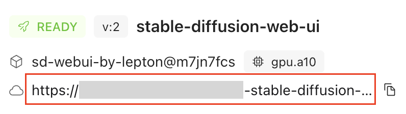

# Stable Diffusion Web UI

Stable Diffusion Web UI is a web browser interface tool to easily manage model checkpoints, loras, and configurations for image generation tasks with the Stable Diffusion model, an AI model can generate images from text prompts or modify existing images with text prompts. This documentation will walk you through setting up your environment, adding your choice of models or Loras, and generating an image.

# Configurations

Here are the configurations you can set for your deployment:
- Name: The name of your deployment, like “my-image-studio”
- Resource Shape: Resource used for running the Web UI. `gpu.a10` is recommended 

Once these fields are set, click `Deploy` button at the bottom of the page to create the deployment. You can see the deployment has now been created under [Deployments](https://dashboard.lepton.ai/workspace-redirect/deployments). Click on the deployment name to check the details. You’ll be able to see the deployment URL and status on this page.

Once the status is turned into `Ready`, click the URL on the deployment card to access it:

When you first click on it, we will create a deployment token to allow access to the web UI - this token is used only for this deployment, and your web UI stays secure and private. Always access the web UI via the workspace portal to ensure the token is created and passed to the web UI. If you would like the deployment to be accessible by anyone, you can edit the deployment, and make it public:

# Generate your first image

Once you load the WebUI by visiting the deployment URL, you’ll be able to generate your first image by keying in a few prompts to the Prompt text box. Then click Generate button on the right to generate your image, and you’ll see the result shortly.

# Add your own models

If you’d like to add a model including checkpoint, Lora, or VAE from Civitai, you could use the Civitai Helper tool on top to do so. You can find this tool at the top of the screen. 

To download a model from Civitai, copy the link from browser and paste to the `Civtal URL` , then click `1.Get Model info by Civital URL` button on the right to fetch the model info.

Once the Model Name shows on the screen, choose / as the subfolder and expected version. Then click 3.Download Model , the download process will start. Once the download finished, the info will be shown under the `Downloaded Model` button.

# Access the model added

To use the model downloaded, you need to reload the corresponding part of the Web UI, so it can find the model downloaded. In this case (the model we downloaded is a checkpoint), click the reload button on top to refresh available checkpoints.

Now you can switch the newly downloaded checkpoints to generate the image again.

Vola! Now your cat looks more like a cat from animation. Feel free to try out different settings and see what you can get!

# FAQs

Q: How does pricing work for using Stable Diffusion Web UI via Lepton?

A: The pricing will be generated based on the usage of resources. In this case, computing resources mainly. If you choose to mount storage during the setting up phase, the storage fee will apply based on the usage. For more details on the pricing about resources, you can checkout [Lepton AI Pricing](https://www.lepton.ai/pricing)

Q: Can I use my locally trained models such as checkpoints or loras without using Civital Helper? How to do so?

A: You can definitely do this. One easier way to do this is to mount storage during the setting up stage, and upload your models into corresponding folders. For instructions to upload models to storage, checkout the [CLI reference](https://www.lepton.ai/references/lep_storage#lep-storage-upload).

Q: Will files get deleted when I stopped the deployment?

A: It depends if your files are mounted with storage. Files within Lepton Storage will be persistently stored once the path is mounted. And others will get deleted once the deployment is stopped or deleted.

Q: Can I turn this into API so I can make generation with code rather then WebUI?

A: We don’t support using Stable Diffusion Web UI directly as API, but we do provide API for Stable Diffusion as Stable Diffusion Farm where you can find in templates as well. If you’d like to use Stable Diffusion Farm, you can contact us via info@lepton.ai.

Q: Can I share this environment with my team members?

A: Yes. Users within the same workspace will have access to the deployments. If you’d like to add users to your workspace, you can contact us via info@lepton.ai

Q: If I’ve used products like RunDiffusion with Large or Max shape, what’s the corresponding configuration here?

A: We do not know the exact shape of the underlying computation resources for RunDiffusion or other providers. In our experience, `gpu.a10` is on par or slightly better than the Large and Max shape.
